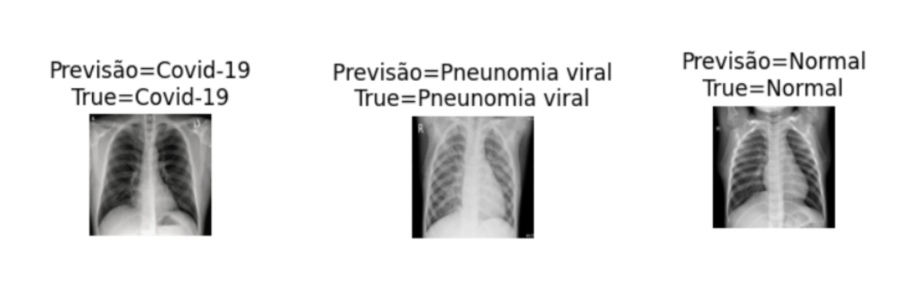
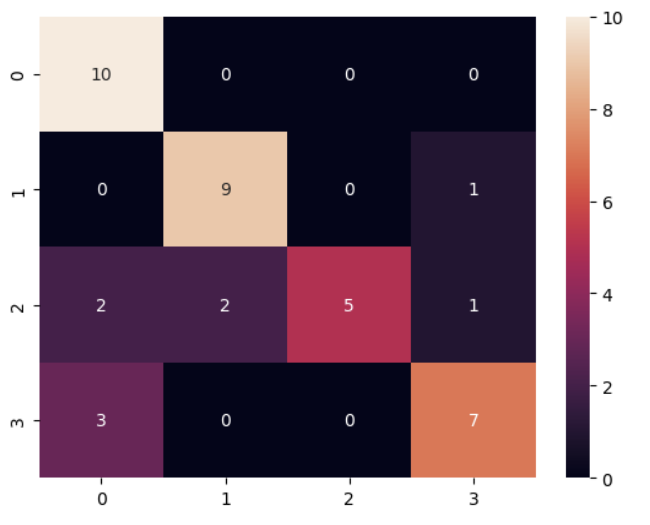

## __Chest X-Ray PoC__

### __Predictions__ 

0: 'Covid-19'
1: 'Normal'
2: 'Pneunomia viral'
3: 'Pneunomia bacterial'

### __Results__ 

**Examples**

    </a>

**Classification Report**

</a>

**Confusion Matrix**

</a>

### __Download Model__ 

https://drive.google.com/file/d/1Pg-tWdFLzu-1RdDV_9ZiUxrf7ZUsYrVU/view?usp=drive_link

